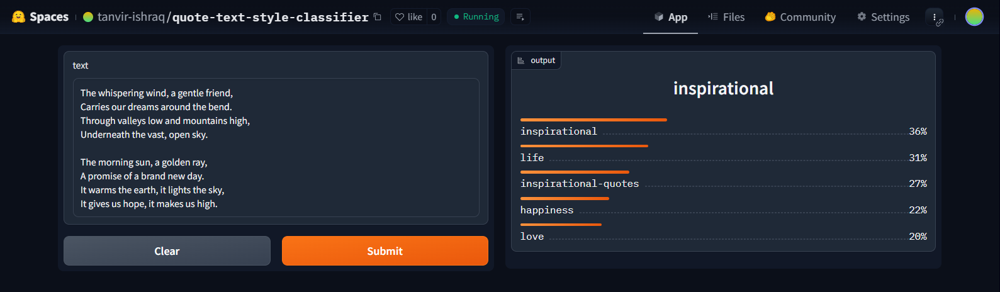
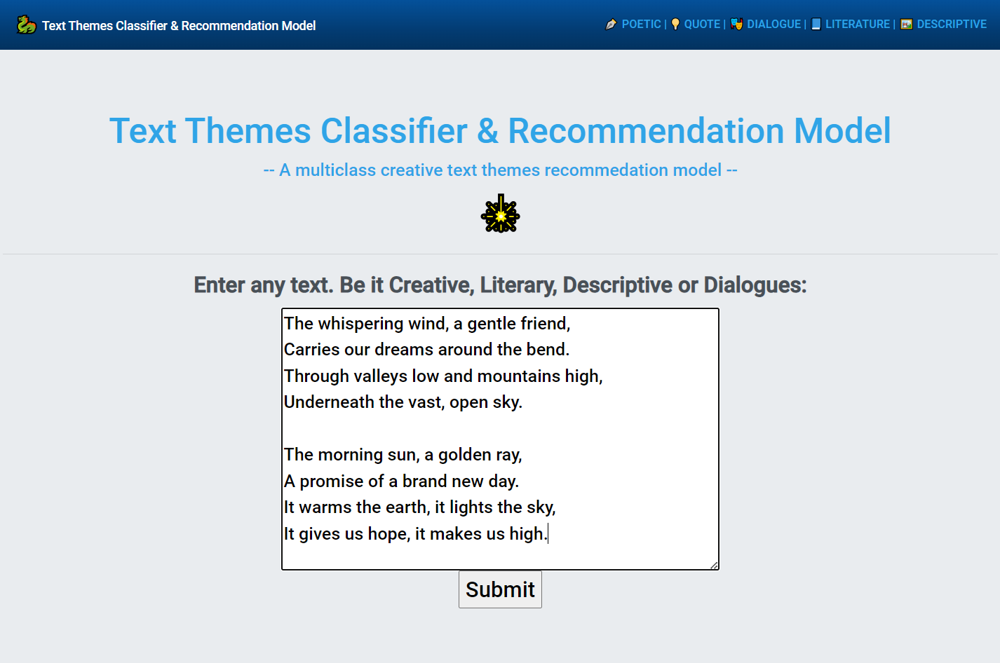
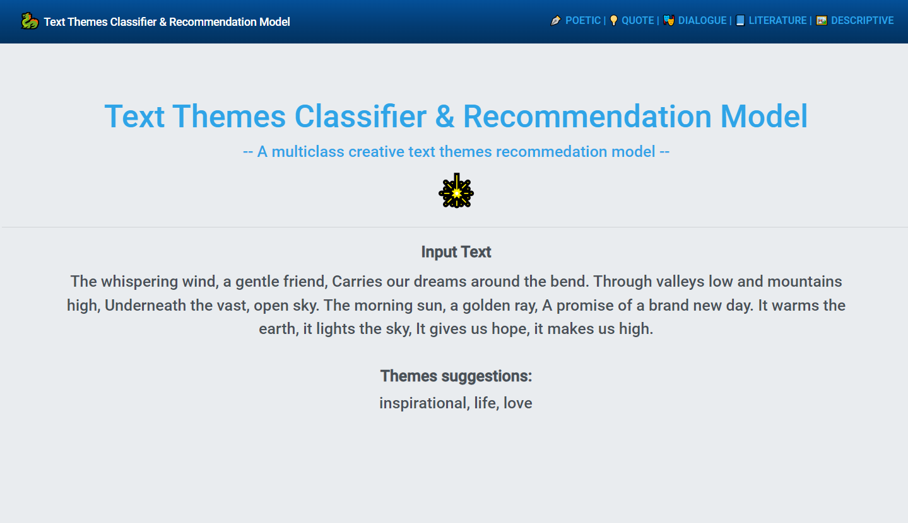

# TextThema - Content Classifier and Recommender System

A Text Content Themes Classifier and smart Recommender System. 
Here is documentation of the project process from data collection, model training, and deployment.  
The model can classify 103 different types of themes despite from input. Despite the input content is Creative, poetry, Literary, Descriptive, synopsis, quotes, songs or Dialogues: The keys of `deployment_hf\tag_types_encoded.json` shows the theme types. 

The goal of this project was multimodal. To cover diverse range of objectives.
* detect nuances like humor and simile/metaphor
* detect Author Intents and content themes 
* possibly detect plus recommend related books, famous people/authors, fictional character, franchise from input content. so, you can explore new horizons according to your interest
* automate / recommend hashtags.

 ## Data Collection

Data was collected from a Goodreads Quotes Listing: https://www.goodreads.com/quotes  
The Dynamic website's unpredictable time based login prompts were handled. The data collection process was as follows: 

The massive NLP data were scraped with `scraper/nlp_dataset_scraper.py` and stored in `scraper/quote-nlp-dataset-scraped.csv`. I employed an effecient tracking management system for scrap of massive NLP data to prevent data loss.

In total, I scraped ~43,000 different content style data e.g. quote, poems, synopsis, dialogue, story and corresponding data's themes, tags. Finally, ~38,500 dataset reamined after cleaning.

## Data Preprocessing
Initially there were lots of themes and tags in the dataset. After some analysis, I found out many of them are rare themes and tags (probably custom tags by users). So, I removed those tags and then I kept *103* themes and tags for intial test. After that, I removed any noisy data due to scraping and dropped any duplicate occurences resulting in *~38500* samples.

## Model Training 
Finetuned a `roberta-base` (RoBERTa) model which is a transformers model from HuggingFace Transformers using Fastai and Blurr. With ~95% accuracy. The model training notebook can be viewed [here](https://github.com/tanvir-ishraq/TextThema-Multi-Classifier/blob/main/notebooks/quote-multi-classifier.ipynb)

## Benchmark

## Model Compression and ONNX Inference
The trained model has a memory of 900+MB. I compressed this model using ONNX quantization and brought it to 125MB. 

## Model Deployment

The compressed model is deployed to HuggingFace Spaces Gradio App. The implementation can be found in `deployment` folder or [here](https://huggingface.co/spaces/tanvir-ishraq/quote-text-style-classifierr) 

 

## Live Website Deployment
Deployed a Flask App built to take text content and show the themes and recommendations as output. Check `flask-deployment` branch. The website is live [here](https://textthema-multi-classifier.onrender.com/) 

